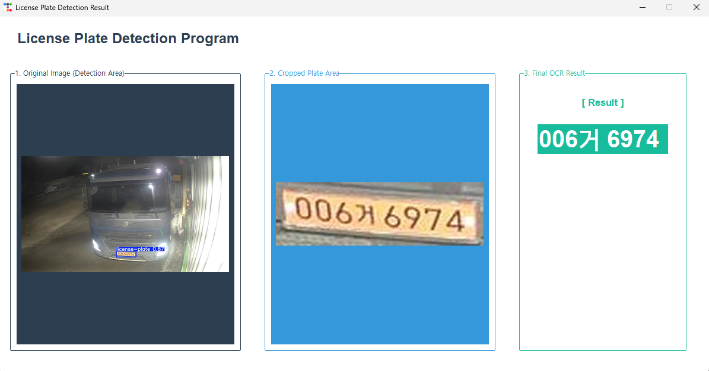

# License Plate Recognition System

This project is an example of detecting vehicle license plates and recognizing their text using **YOLO (You Only Look Once)** and **OCR (Optical Character Recognition)** techniques.

## Project Overview

The system processes are being implemented through four main stages:

1.  **Dataset Preparation & Model Training**:
    - Download the license plate dataset from [roboflow](https://universe.roboflow.com/detection-v0zc6/-49xql).
    - Train the YOLO model to recognize license plates as specific objects.
2.  **License Plate Detection**:
    - Use the trained YOLO model to detect and locate license plate regions within the source image.
3.  **OCR (Text Recognition)**:
    - Extract text from the detected number plate area using OCR technology.
4.  **Visualization**:
    - Display the detected area of number plate and text in tkinter overlay.

## Built With & Dependencies

This project is built using Python. The key libraries and their recommended versions are listed below:

| Package                | Version  | Description                                   |
| :--------------------- | :------- | :-------------------------------------------- |
| **OpenCV**             | `4.x`    | Image processing and visualization            |
| **Ultralytics (YOLO)** | `8.0+`   | Object detection model training and inference |
| **EasyOCR**            | `Latest` | Optical Character Recognition                 |
| **NumPy**              | `1.2x`   | Matrix operations and data handling           |
| **ttkbootstrap**       | `Latest` | Modern GUI theming for Tkinter                |
| **Pillow**             | `Latest` | Python Imaging Library for GUI image handling |

## How to Run

1. Clone the repository:

   ```bash
   git clone https://github.com/belivejs/CarNumberOCR.git
   cd CarNumberOCR
   ```

2. Install the required packages:

   ```bash
   pip install -r requirements.txt
   ```

3. Run the main application:

   ```bash
   python -u main.py
   ```

## Example



## Limitations

- **No File Upload Feature**: This system operates as a local command-line tool and does not support file uploads
- **Image Only (No Video Support)**: The detection and recognition pipeline is optimized for **static images only**. Real-time video processing or video file support is not implemented in this version.

## References

- https://universe.roboflow.com/detection-v0zc6/-49xql
- https://42morrow.tistory.com/entry/%EC%B0%A8%EB%9F%89-%EB%B2%88%ED%98%B8%ED%8C%90-%EC%9D%B8%EC%8B%9D-%ED%85%8C%EC%8A%A4%ED%8A%B8
- https://github.com/tas-neem/number-plate-recognition
